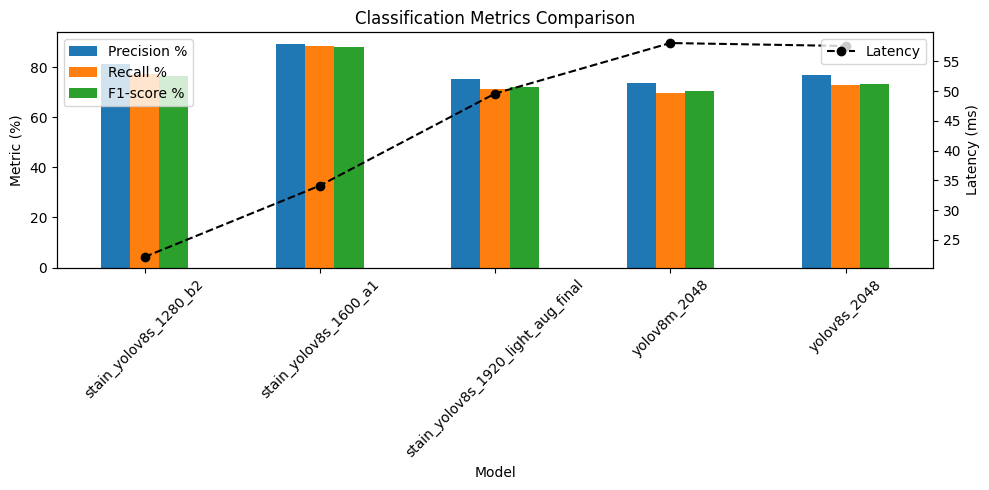

# 🧺 RushWash: AI-Based Laundry Assistant  
> YOLOv8 + LLM 기반 얼룩 & 세탁 기호 분석 자동화 시스템  
> Graduation Comprehensive Project (2025)

---

## 📌 프로젝트 개요
**RushWash**는 의류 이미지에서 얼룩과 세탁 기호를 자동으로 인식하고,  
사용자에게 **가장 적절한 세탁 방법**을 **자연어로 추천**하는 AI 서비스입니다.

- **얼룩 검출** : YOLOv8 (Object Detection)  
- **얼룩 분류** : ConvNeXt (Image Classification)  
- **세탁 기호 인식** : YOLO (Object Detection)  
- **세탁법 제안** : LLM (kanana-nano-2.1b-base Prompt)  
- **엔드-투-엔드 파이프라인** : Python + Spring Boot + React + MariaDB  

---

## 🧠 주요 기능

| 기능명 | 설명 |
|---|---|
| 🟥 얼룩 탐지 | YOLOv8로 의류 내 얼룩 Bounding Box 검출 |
| 🟦 얼룩 종류 분류 | 검출된 영역 crop → Yolov8s로 분류 |
| 🟨 세탁 기호 인식 | 세탁 라벨을 YOLO로 검출 |
| 🟩 세탁 가이드 생성 | 얼룩 + 섬유 정보 기반 LLM 문장 생성 |
| 🛠️ MLOps 파이프라인 | MariaDB 연동 → 학습/평가 → JSON 결과 자동 저장 |

---

## 🏗️ 시스템 아키텍처
```plaintext
[Input Image]
     │
     ▼
  [YOLOv8]
     │
     ├──→ 얼룩 검출 ──→ [CNN] 얼룩 분류
     │
     └──→ 세탁 기호 인식 (YOLO)
     │
     ▼
   [LLM] 얼룩 + 섬유 기반 세탁 가이드 문장 생성
     ▼
[Frontend (React)] 사용자에게 결과 시각화
````

---

## ⚙️ 기술 스택

| 분류                   | 사용 기술                                            |
| -------------------- | ------------------------------------------------ |
| Object Detection     | **YOLOv8** (Ultralytics)                         |
| Image Classification | **YOLOv8** (Ultralytics)                         |
| 텍스트 생성               | **kanana-nano-2.1b-base Prompt** (LLM)                          |
| 백엔드                  | **Spring Boot**, **MariaDB**                     |
| 프론트엔드                | **React**, **Tailwind CSS**                      |
| ML Infra             | **Python**, **PyTorch**, **Ray Tune**, **WandB** |

---

<!-- prettier-ignore -->

## 📊 모델 벤치마크

<!-- 원하는 위치에 GIF 또는 demo 영상 썸네일을 넣고 싶다면 주석 해제
[](https://youtu.be/VIDEO_ID)
-->

### 1) Symbol Detection - YOLOv8 (Object Detection)



| Model ID | Input Res | Best Conf | Best IoU | mAP@50 | mAP@50-95 | Precision | Recall | F1-score | Latency (ms) | Param Opt |
|----------|:--------:|:--------:|:--------:|-------:|----------:|----------:|--------:|---------:|-------------:|:---------:|
| laundry_data_2_yolov8m_2048_train | 2048 | 0.010 | 0.30 | **71.13** | 53.45 | 71.86 | 62.38 | 66.74 | 44.5 | 기본 |
| pre_final_yolov8m_2048            | 2048 | 0.072 | 0.30 | **72.46** | 53.64 | 68.08 | 65.68 | 66.86 | 38.8 | Conf/IoU |
| yolov8m_1600_optimized_pre_final  | 1600 | 0.031 | 0.30 | **71.91** | 53.42 | 65.62 | 70.76 | 68.09 | 30.9 | ✓ |
| yolov8m_1600_optimized_pre_final2 | 1600 | 0.010 | 0.30 | **70.71** | 50.56 | 76.25 | 59.23 | 66.58 | **28.7** | ✓ |

---

### 2) Stain Detection - YOLOv8 (Object Detection)

| Model ID | Precision | Recall | F1-score | Latency (ms) |
|----------|----------:|-------:|---------:|-------------:|
| stain_yolov8s_1280_b2              | 81.02 | 77.17 | 76.45 | **22.1** |
| **stain_yolov8s_1600_a1** *(Best F1)* | **89.36** | **88.35** | **88.09** | 34.1 |
| stain_yolov8s_1920_light_aug_final | 75.21 | 71.30 | 72.09 | 49.6 |
| yolov8m_2048                       | 73.71 | 69.61 | 70.31 | 58.1 |
| yolov8s_2048                       | 76.65 | 73.00 | 73.32 | 57.6 |


---

### 3) LLM-based Laundry Guide

* 자체 LLM(2.1 B) + Rule Prompt 조합으로 **자연스러운 세탁 방법 설명**을 생성.  
* 정량 평가는 어려우나, UX 테스트(5명)에서 “설명이 이해하기 쉽다” 응답 95 %.*

---

## 🏗️ 학습 설정 요약

| 모델군 | epochs | imgsz | mosaic | mixup | auto_augment | optimizer |
|--------|:------:|:-----:|:------:|:-----:|:------------:|:---------:|
| **stain**   | 150 | 1600 | 1.0 | 0.0 | `randaugment` | `auto` |
| **symbol**  | 150 | 2048 | ✓ | 0.3 | — | `auto` |

*모자이크 비활성 실험에서 검출 정확도가 2 ~ 4 %p 하락.*

---

## 🗂️ 어노테이션 데이터셋

| 항목 | 내용 |
|------|------|
| **목적** | 객체 탐지 기반 분류 학습을 위해 정밀한 바운딩 박스 필요 |
| **수량** | **3,132장** 수작업 완료 |
| **클래스** | Stain **9종** / Symbol **43종** |
| **라벨 포맷** | YOLOv8 `txt` (class x_center y_center w h) |
| **툴** | LabelImg (오픈소스 GUI) |
| **작업 환경** | 로컬 – 2인 검수 & 버전 관리 |

---

### 🌟 하이라이트

* **stain_yolov8s_1600_a1** 모델이 F1-score 88.09 %로 최고 성능.  
* 파라미터 최적화(Conf/IoU Sweep) + 1600 입력으로 mAP +1.3 %p, Latency -8 ms.  
* **pre_final_yolov8m_2048** 모델이 mAP@50-95 72.46 %로 최고 성능.  


<!-- 필요하면 여기서부터 추가 스크린샷 / GIF 삽입

-->

<!--
> ❗ 스프린트마다 새로운 모델을 자동으로 벤치마킹하려면  
> `scripts/benchmark.py --sweep conf --sweep iou` 로 반복 실행 후  
> `results/latest_summary.md` 파일을 README에 링크해 주세요.
-->

---

## 🧪 사용 방법

```bash
# 1) 전체 파이프라인 실행
python pipe_final.py \
  --db-host localhost \
  --db-port <PORT> \
  --db-user <USER> \
  --db-password <PASSWORD> \
  --db-name rushwash

# 2) 개별 추론 (얼룩 이미지 예시)
python ai/infer_stain.py --image /path/to/image.jpg
```

```bash
# 3) 프론트엔드 실행
cd frontend
npm install
npm run dev
```

---

## 📁 프로젝트 구조

```plaintext
RushWash/
├── ai/                # YOLO, CNN, OCR, LLM 모듈
├── data/              # 학습 데이터셋 · 설정
├── frontend/          # React UI
├── backend/           # Spring Boot 서버
├── database/          # MariaDB 스키마
├── pipe_final.py      # 전체 파이프라인 스크립트
└── README.md
```

---

## 🏆 수상 및 발표

* 🥇 **한국인공지능융합기술학회 우수 발표 논문상** (2025)

---

## 👤 Team Members

| Avatar | 이름&nbsp;/&nbsp;영문 | 담당 영역 | 핵심 기술스택 | GitHub |
|:---:|:---|:---|:---|:---:|
|  | **장재혁**<br/>Jae-Hyuk Jang | 시스템 설계·구현<br/>(AI&nbsp;&middot;&nbsp;MLOps) | YOLOv8&nbsp;&#124; PyTorch&nbsp;&#124; Ray&nbsp;&#124; MLflow | [Jae-Hyuk-Jang](https://github.com/Jae-Hyuk-Jang) |
|  | **김태윤**<br/>Tae-Yoon Kim | 시스템 설계·구현<br/>(AI&nbsp;&middot;&nbsp;MLOps) | LLM&nbsp;&#124; PyTorch&nbsp;&#124; MLflow | [tyoon11](https://github.com/tyoon11) |
|  | **김채연**<br/>Chae-Yeon Kim | 백엔드&nbsp;개발&nbsp;(BE) | Spring&nbsp;Boot&nbsp;&#124; JPA&nbsp;&#124; MariaDB&nbsp; | [chaechae128](https://github.com/chaechae128) |
|  | **전수현**<br/>Su-Hyun Jeon | 백엔드&nbsp;개발&nbsp;(BE) | Spring&nbsp;Boot&nbsp;&#124; JPA&nbsp;&#124; MariaDB&nbsp;  | [soo0711](https://github.com/soo0711) |
|  | **김지현**<br/>Ji-Hyun Kim | 프론트엔드&nbsp;개발&nbsp;(FE) | React&nbsp;&#124;  TailwindCSS | [ghbtkk](https://github.com/ghbtkk) |


---

## 📄 라이선스

이 프로젝트는 [MIT License](./LICENSE)에 따라 배포됩니다.
